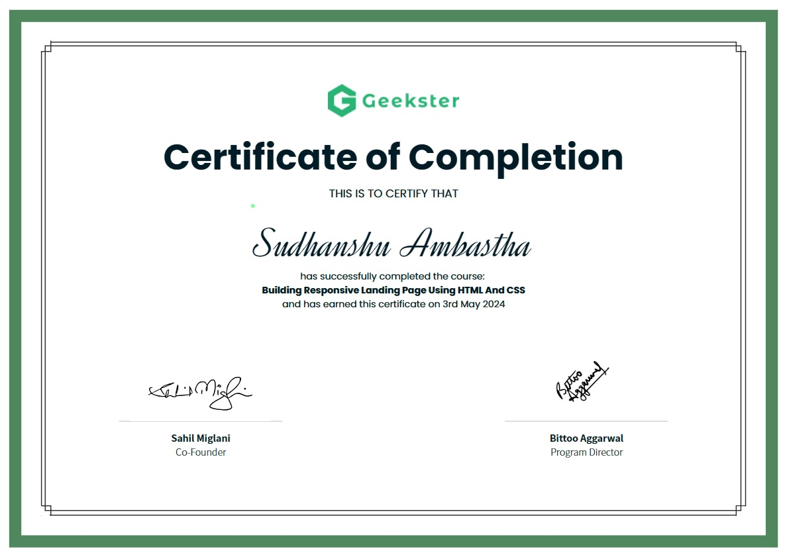

# Responsive Landing Page with React.js & Sass

This project is a responsive landing page built using React.js. It is based on a design available on [Free CSS](https://www.free-css.com/assets/files/free-css-templates/preview/page259/aria/). The landing page features a header, main content section, and a footer. The main content section includes various sections such as About, Links, Tools, and Partners.

## Preview
<picture></picture>

## Certificate



## Installation

To run this project locally, follow these steps:

1. Clone the repository to your local machine:

   ```bash
   git clone https://github.com/Sudhanshu-Ambastha/Responsive-Landingpage-Reactjs-Scss.git
   ```

2. Navigate to the project directory:
   ```
   cd landingpage
   ```

3. Install dependencies:
   ```
   npm install && npm install sass
   ```
   ```
   npm install @fortawesome/react-fontawesome && npm install @fortawesome/free-solid-svg-icons @fortawesome/free-brands-svg-icons
   ```
   ```
   npm install lucide-react && npm install react-icons

   ```
   ```
   npm install react-router-dom && npm install react-scroll

   ```
4. Start the development server:
   ```
   npm start
   ```

## Technologies Used
- `React.js`: A JavaScript library for building user interfaces.
- `SCSS`: A CSS pre-processor that adds features like variables, mix-ins, and nesting to CSS.
- `npm`: A package manager for Node.js packages.

## Usage
Feel free to modify and customize this landing page according to your needs. You can update the content, styles, or add new sections as required.

## Credits
Design Inspiration: [Free CSS - Aria Template](https://www.free-css.com/assets/files/free-css-templates/preview/page259/aria/)
